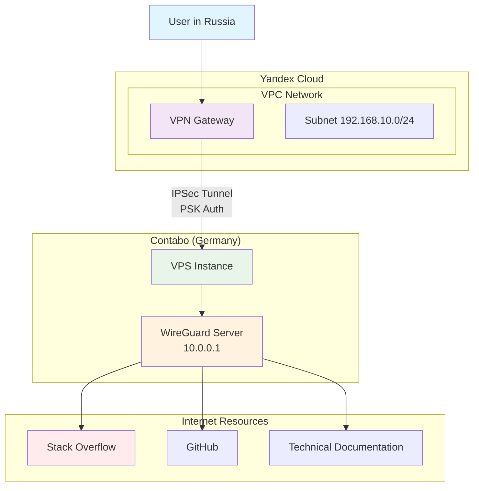
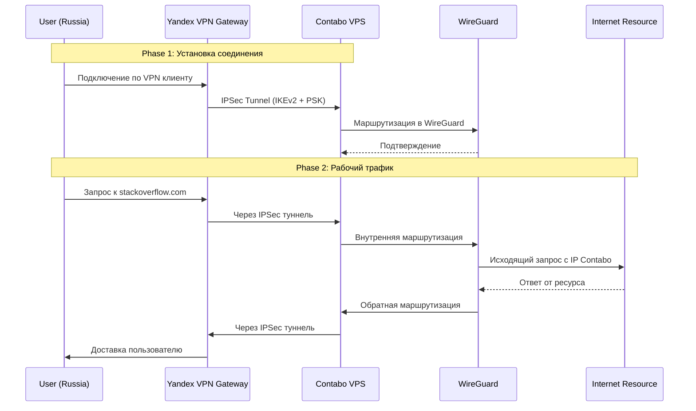

### **Архитектура решиния**

Клиент Устройство → Yandex Cloud VPN Gateway → Contabo VPS (VPN-сервер) → Интернет

#### **Роль компонентов:**

- **Contabo VPS:** VPN-сервер (WireGuard/OpenVPN), выходит в интернет

- **Yandex Cloud:** VPN Gateway, точка входа в вашу инфраструктуру

- **Terraform:** управление всей конфигурацией как кодом
 
 ### **Архитектурная схема в Mermaid**
     

### **Диаграмма последовательности**
 

